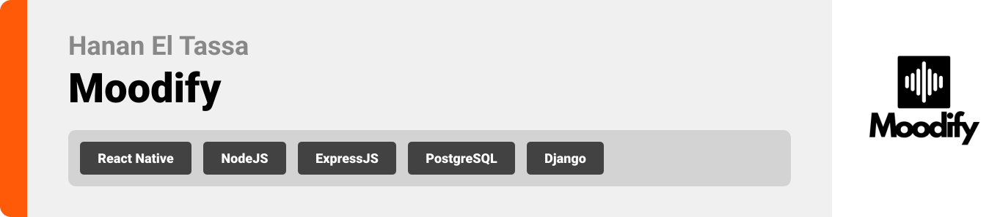

<br><br>

<!-- project philosophy -->


> **Moodify** is a mobile application designed to enhance user well-being through personalized music recommendations based on emotional states and activities.
>
>
> By leveraging AI-driven mood analysis, Moodify creates tailored playlists, offers actionable insights, and provides emotional support through an interactive AI coach. The app aims to empower users to improve their mental well-being with seamless music integration.

### User Stories
**Normal User**
- As a user, I want to log my mood using text, voice, or facial expressions, so the app can provide personalized music recommendations.
- As a user, I want to access activity-based playlists, so I can find music that matches my current tasks or workouts.
- As a user, I want the app to track my mood patterns over time, so I can understand and improve my mental health.

**AI Coach User**
- As a coach, I want to analyze mood data trends, so I can recommend activities and playlists to improve the user's well-being.
- As a coach, I want to offer mood-enhancing challenges, so users can engage in activities that boost their emotional health.
- As a coach, I want to curate personalized music playlists based on user data and environmental factors (e.g., time of day, weather), so users have relevant music options.

**Admin User**
- As an admin, I want to manage and analyze user data, so I can understand app usage trends and ensure data-driven improvements.
- As an admin, I want to monitor and refine AI-generated challenges and recommendations, so they align with the app’s objectives.
- As an admin, I want to access analytical dashboards, so I can track user engagement and emotional health patterns across the platform.

<br><br>
<!-- Tech stack -->


### Moodify is built using the following technologies:

- This project uses [React](https://reactjs.org/) and [React Native](https://reactnative.dev/) for the frontend. React is used for the web admin dashboard, while React Native powers the mobile application for a seamless experience on both iOS and Android.
- For mobile app development, the app leverages [Expo](https://expo.dev/). Expo streamlines the development process with its set of tools and services for building, deploying, and testing React Native applications.
- For backend services, the app uses [Node.js](https://nodejs.org/) with [Express.js](https://expressjs.com/). Node.js provides a scalable runtime environment, and Express.js is used to handle APIs and backend logic efficiently.
- For persistent storage (database), the app uses [PostgreSQL](https://www.postgresql.org/). PostgreSQL is a relational database that stores user data, mood logs, playlists, and activity records.
- The app integrates [Spotify API](https://developer.spotify.com/) and [Jamendo API](https://devportal.jamendo.com/) to fetch music tracks, playlists, and trending songs, enriching the user experience with curated music content.
- The app also integrates [Django](https://www.djangoproject.com/) for implementing the mood detection models, leveraging its robust framework for handling AI/ML model interactions and API endpoints.
- For deploying backend services and handling infrastructure, the app uses [AWS](https://aws.amazon.com/), leveraging services such as EC2 for servers.
- For authentication and secure user sessions, the app integrates [JWT](https://jwt.io/) (JSON Web Tokens), ensuring safe and efficient login processes across platforms.
- The app follows modern design principles and uses a clean and intuitive user interface for an optimal user experience.
- The app uses the font ["Avenir Next LT Pro"](https://fontsgeek.com/fonts/avenir-next-lt-pro-regular) as its primary font, ensuring a clean and modern design for an intuitive user experience.

<br><br>
<!-- UI UX -->


> We designed Moodify to prioritize user experience, with a clean, intuitive interface for mood tracking, playlist recommendations, and AI interactions.

- Project Figma design [figma](https://www.figma.com/design/jxAPLVYsC8L0ZPUDLYSTmV/Moodify?node-id=0-1&node-type=canvas&t=1C0GiuzVrIbosv6F-0)


### Mockups
| Home Screen | Mood Tracking Screen | Playlist Screen |
| ---| ---| ---|
| 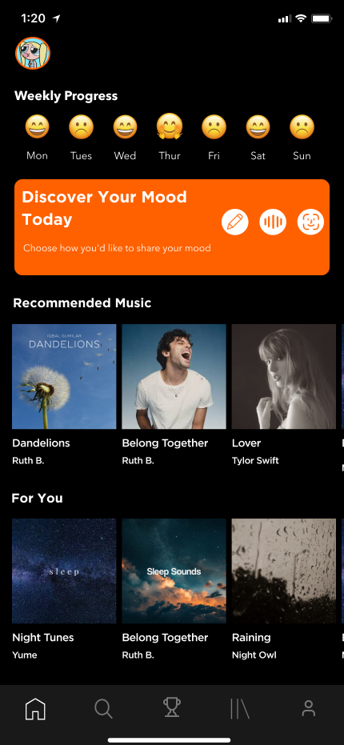 |  | 

<br><br>

<!-- Database Design -->


###  Architecting Data Excellence: Innovative Database Design Strategies:

Moodify uses [PostgreSQL](https://www.postgresql.org/), a relational database, to store and manage all application data efficiently. Below is the updated structure of the main tables in the database:

- **Users Table**:
  ```sql
  CREATE TABLE Users (
      id SERIAL PRIMARY KEY,
      name VARCHAR(255) NOT NULL,
      email VARCHAR(255) UNIQUE NOT NULL,
      password TEXT,
      spotify_id VARCHAR(255) UNIQUE,
      access_token TEXT,
      refresh_token TEXT,
      profile_picture TEXT,
      role ENUM('user', 'admin') NOT NULL,
      is_banned BOOLEAN DEFAULT FALSE,
      gender ENUM('male', 'female', 'other'),
      birthday DATE,
      created_at TIMESTAMP DEFAULT now(),
      updated_at TIMESTAMP DEFAULT now()
  );
  ```

- **SpotifyUserData Table**:
  ```sql
  CREATE TABLE SpotifyUserData (
    id SERIAL PRIMARY KEY,
    user_id INT REFERENCES Users(id),
    liked_songs JSONB, -- Stores a list of liked songs
    top_artists JSONB, -- Stores a list of top artists
    playlists JSONB, -- Stores Spotify playlists
    created_at TIMESTAMP DEFAULT now(),
    updated_at TIMESTAMP DEFAULT now()
  );
  ```

- **SpotifyGlobalData Table**:
  ```sql
  CREATE TABLE SpotifyGlobalData (
    id SERIAL PRIMARY KEY,
    type ENUM('artist', 'track', 'album') NOT NULL,
    spotify_id VARCHAR(255) UNIQUE NOT NULL,
    name VARCHAR(255) NOT NULL,
    metadata JSONB NOT NULL, -- Stores additional information (e.g., genre, release date)
    popularity INT, -- Popularity score
    created_at TIMESTAMP DEFAULT now(),
    updated_at TIMESTAMP DEFAULT now()
  );
  ```

- **MoodDetectionInputs Table**:
  ```sql
  CREATE TABLE MoodDetectionInputs (
      id SERIAL PRIMARY KEY,
      user_id INT REFERENCES Users(id),
      input_type VARCHAR(50) NOT NULL, -- e.g., voice, text, facial expressions
      input_data TEXT,
      detected_mood VARCHAR(50) NOT NULL,
      confidence DECIMAL(5,2), -- Confidence level in percentage
      created_at TIMESTAMP DEFAULT now(),
      updated_at TIMESTAMP DEFAULT now()
  );
  ```

- **Challenges Table**:
  ```sql
    CREATE TABLE Challenges (
      id SERIAL PRIMARY KEY,
      user_id INT REFERENCES Users(id),
      text TEXT NOT NULL,
      type VARCHAR(50) NOT NULL, -- Challenge type
      status ENUM('pending', 'completed', 'rejected') NOT NULL,
      time_of_day TIME,
      is_daily BOOLEAN DEFAULT FALSE,
      completed_at TIMESTAMP,
      created_at TIMESTAMP DEFAULT now(),
      updated_at TIMESTAMP DEFAULT now()
  );
  ```
- **Playlists Table**:
  ```sql
  CREATE TABLE Playlists (
      id SERIAL PRIMARY KEY,
      user_id INT REFERENCES Users(id),
      name VARCHAR(255) NOT NULL,
      is_default BOOLEAN DEFAULT FALSE,
      created_at TIMESTAMP DEFAULT now(),
      updated_at TIMESTAMP DEFAULT now()
  );
  ```
- **PlaylistSongs Table**:
  ```sql
  CREATE TABLE PlaylistSongs (
      id SERIAL PRIMARY KEY,
      playlist_id INT REFERENCES Playlists(id),
      source VARCHAR(50), -- e.g., local, Spotify
      external_id VARCHAR(255), -- External song identifier
      metadata JSONB, -- Stores song details (e.g., title, artist, album, duration)
      created_at TIMESTAMP DEFAULT now(),
      updated_at TIMESTAMP DEFAULT now()
  );
  ```


### ER Diagram

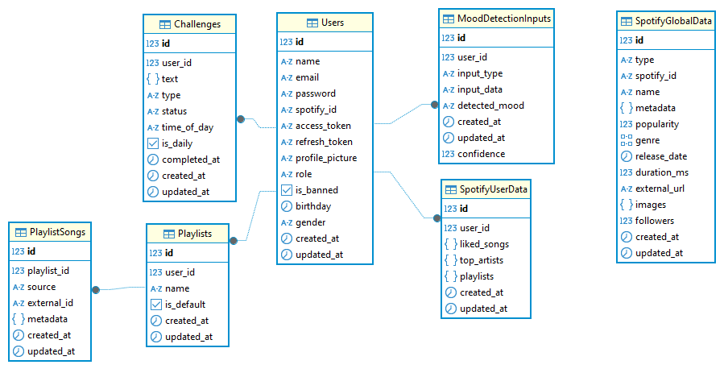

<br><br>


<!-- Implementation -->


### User Screens (Mobile)
| Login screen  | Home screen | Loading screen |
| ---| ---| ---|
|  | 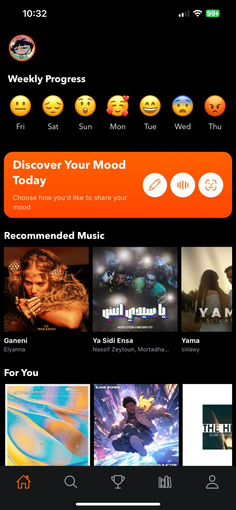 |  |
| Video Detect Mood Screen | Voice Detect Mood Screen | Text Detect Mood Screen |
|  |  |  |
| Challenges screen | Search Screen | 
|  |  |


### Admin Screens (Web)
| Login screen  | Dashboard screen |
| ---| ---|
| 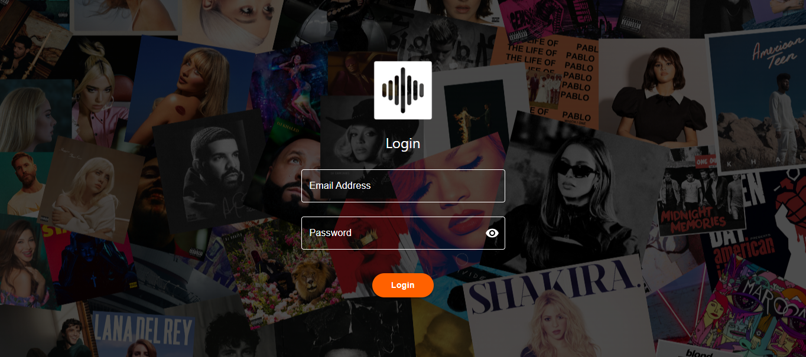 | 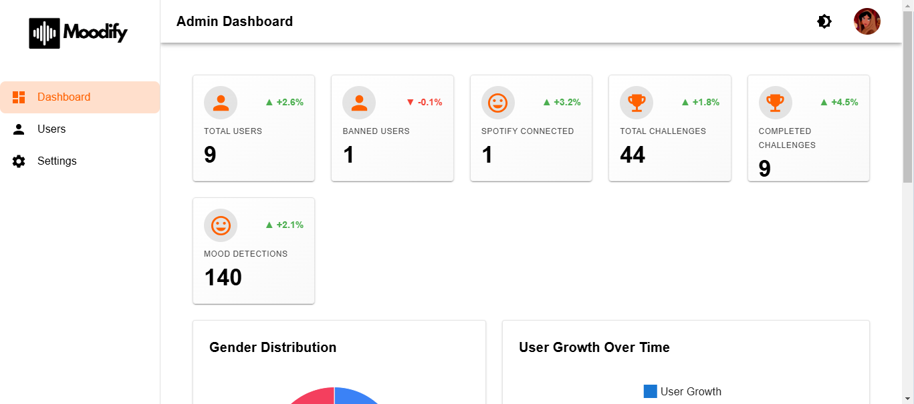 |
| Dashboard screen |  Users screen |
| 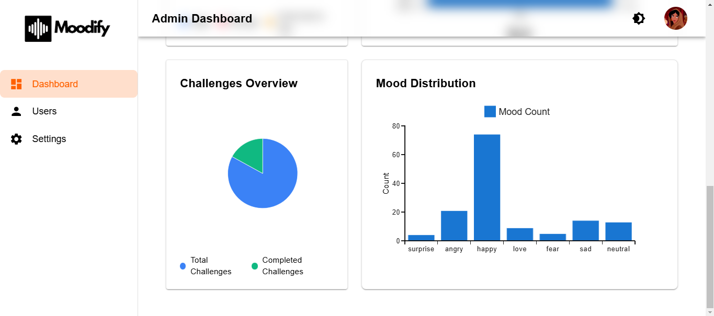 | 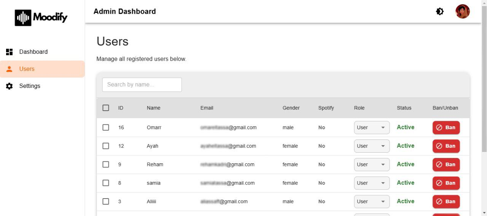 |

<br><br>


<!-- Prompt Engineering -->


### Discover the Key to Effective Communication Through Prompt Engineering

This project utilizes **advanced prompt engineering techniques** to interact seamlessly with **OpenAI's GPT-4**, delivering highly personalized and context-aware challenges for users. By leveraging user-specific inputs like mood, time of day, and previously generated challenges, the system ensures unique and relevant outputs every time.

#### How Prompt Engineering Works
1. **Dynamic Inputs**:
   - The prompt is dynamically generated using user-specific variables such as `mood`, `time_of_day`, and a list of `existingChallengeTexts`. These inputs provide the context needed for GPT-4 to craft highly tailored responses.

2. **Avoiding Duplicates**:
   - The system ensures no duplication of challenges by explicitly including previously generated challenges in the prompt. This enhances user experience by keeping content fresh and engaging.

3. **Structured Outputs**:
   - The prompt instructs GPT-4 to format the response in a predefined JSON structure. This ensures consistency and makes it easy for the backend to parse and process the response.

#### Example Prompt
Below is an example of the structured prompt used in the application:

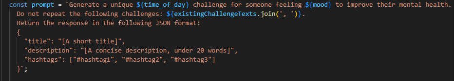

This prompt dynamically incorporates real-time user data, guiding GPT-4 to generate responses like:
- **Title**: "Mindfulness Breakfast"
- **Description**: "Enjoy your breakfast mindfully, savor every bite and every taste."
- **Hashtags**: `#MindfulEating`, `#HappinessIsNow`, `#TasteTheMoment`

#### Benefits of Prompt Engineering
- **Enhanced Personalization**: Every challenge is crafted to align with the user’s current mood and context.
- **High Accuracy**: The structured format ensures outputs meet specific requirements, minimizing the need for manual intervention.
- **Dynamic Scalability**: Prompts adapt to varying inputs, allowing the system to handle diverse use cases efficiently.

This combination of dynamic prompts, validation processes, and structured outputs showcases the power of prompt engineering in delivering a seamless AI interaction experience.

<br><br>

<!-- AWS Deployment -->


### Deploying AI Solutions with the Power of AWS Integration

This project leverages AWS for seamless deployment of our AI-powered application, ensuring **scalability**, **reliability**, and **performance**. The backend server operates on an **AWS EC2 instance**, providing robust infrastructure for handling application requests and data processing.

#### API Documentation
Comprehensive API documentation is available through **Postman** for easy integration and testing.


#### API Documentation
Comprehensive API documentation is available through **Postman** for easy integration and testing.

| Login Api| getTrendyMusic Api |
| ---| ---|
| 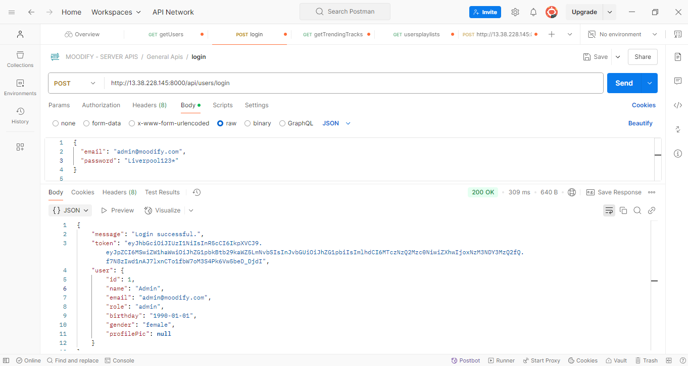 | 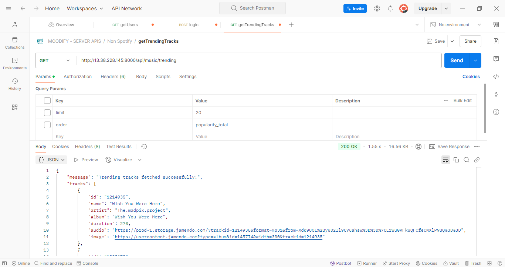 |
| Challenges Api | Spotify Search Api |
| 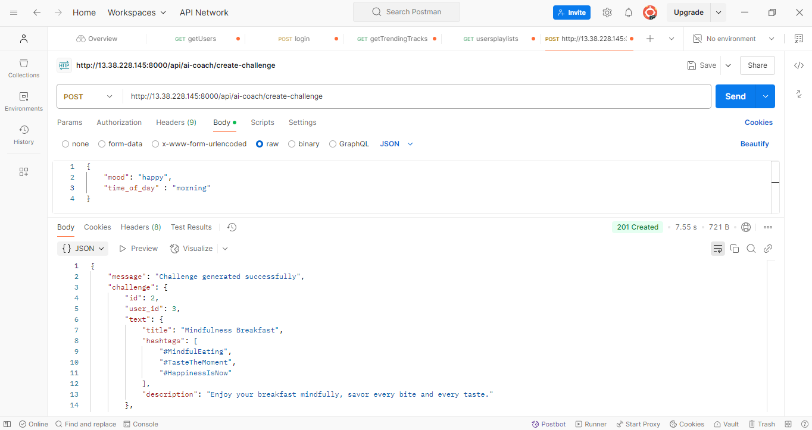 | 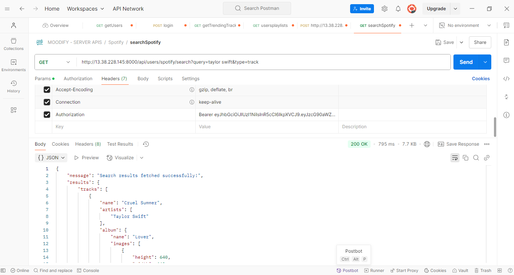 |

<!-- Unit Testing 


###  Precision in Development: Harnessing the Power of Unit Testing:

- This project employs rigorous unit testing methodologies to ensure the reliability and accuracy of code components. By systematically evaluating individual units of the software, we guarantee a robust foundation, identifying and addressing potential issues early in the development process.

<br><br>
-->

<!-- How to run -->


> To set up Moodify locally, follow these steps:

### Prerequisites

This is an example of how to list things you need to use the software and how to install them.
* npm
  ```sh
  npm install
  ```

### Installation

_Below is an example of how you can instruct your audience on installing and setting up your app. This template doesn't rely on any external dependencies or services._

1. Get a free API Key at [OpenAI](https://platform.openai.com/signup/).
2. Clone the repo
   ```sh
   git clone https://github.com/hananeltassa/Moodify-server.git
   ```
3. cd to /Moodify-server
4. Install NPM packages
   ```sh
   npm install
   ```
5. Set up PostgreSQL:
   ### Set up PostgreSQL

a. **Install PostgreSQL**:
   - On **Windows**: Download and install PostgreSQL from [postgresql.org](https://www.postgresql.org/download/). During installation, set a username and password for the default PostgreSQL user (e.g., `postgres`).
   - On **macOS**: Use Homebrew to install PostgreSQL:
     ```sh
     brew install postgresql
     ```
   - On **Linux**: Use your package manager (e.g., `apt` for Ubuntu):
     ```sh
     sudo apt update
     sudo apt install postgresql postgresql-contrib
     ```

b. **Start PostgreSQL Service**:
   - On **Windows**: Start the PostgreSQL service using the Services Manager.
   - On **macOS/Linux**: Start the PostgreSQL server:
     ```sh
     brew services start postgresql # macOS
     sudo service postgresql start # Linux
     ```

c. **Create a Database**:
   - Log in to the PostgreSQL shell as the default user:
     ```sh
     psql -U postgres
     ```
   - Create a new database:
     ```sql
     CREATE DATABASE moodify;
     ```

d. **Add Connection Details to `.env` File**:
   - Create a `.env` file in the root directory of the project if it doesn't exist.
   - Add the following variables, replacing placeholder values with your actual configuration:
     ```env
     DB_HOST=localhost
     DB_PORT=5432
     DB_NAME=moodify
     DB_USER=postgres
     DB_PASSWORD=your_password_here
     ```

7. Run migrations to set up the database schema:
   ```sh
   npm run migrations
   ```

8. Enter your API in `config.js`
   ```js
   const API_KEY = 'ENTER YOUR API';
   ```

9. Start the Application
```sh
  npm start
```
  Access the application at [`http://localhost:3000`](http://localhost:3000) (or the port configured in your app).


Now, you should be able to run Moodify locally and explore its features.
