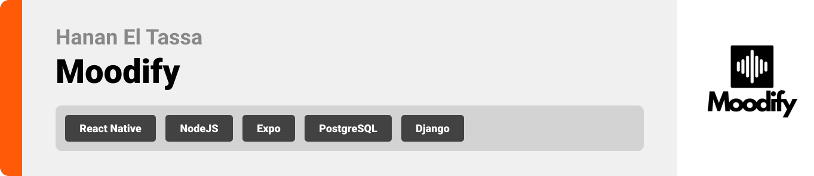

<br><br>

<!-- project philosophy -->


> **Moodify** is a mobile application designed to enhance user well-being through personalized music recommendations based on emotional states and activities.
>
>
> By leveraging AI-driven mood analysis, Moodify creates tailored playlists, offers actionable insights, and provides emotional support through an interactive AI coach. The app aims to empower users to improve their mental well-being with seamless music integration.

### User Stories
**Normal User**
- As a user, I want to log my mood using text, voice, or facial expressions, so the app can provide personalized music recommendations.
- As a user, I want to access activity-based playlists, so I can find music that matches my current tasks or workouts.
- As a user, I want the app to track my mood patterns over time, so I can understand and improve my mental health.

**AI Coach User**
- As a coach, I want to analyze mood data trends, so I can recommend activities and playlists to improve the user's well-being.
- As a coach, I want to offer mood-enhancing challenges, so users can engage in activities that boost their emotional health.
- As a coach, I want to curate personalized music playlists based on user data and environmental factors (e.g., time of day, weather), so users have relevant music options.

**Admin User**
- As an admin, I want to manage and analyze user data, so I can understand app usage trends and ensure data-driven improvements.
- As an admin, I want to monitor and refine AI-generated challenges and recommendations, so they align with the app’s objectives.
- As an admin, I want to access analytical dashboards, so I can track user engagement and emotional health patterns across the platform.

<br><br>
<!-- Tech stack -->


###  Moodify is built using the following technologies:

- This project uses [React](https://reactjs.org/) and [React Native](https://reactnative.dev/) for the frontend. React is used for the web admin dashboard, while React Native powers the mobile application for a seamless experience on both iOS and Android.
- For backend services, the app uses [Node.js](https://nodejs.org/) with [Express.js](https://expressjs.com/). Node.js provides a scalable runtime environment, and Express.js is used to handle APIs and backend logic efficiently.
- For persistent storage (database), the app uses [PostgreSQL](https://www.postgresql.org/). PostgreSQL is a relational database that stores user data, mood logs, playlists, and activity records.
- The app also integrates [Django](https://www.djangoproject.com/) for implementing the mood detection models, leveraging its robust framework for handling AI/ML model interactions and API endpoints.
- The app follows modern design principles and uses a clean and intuitive user interface for an optimal user experience.
- The app uses the font ["Avenir Next LT Pro"](https://fontsgeek.com/fonts/avenir-next-lt-pro-regular) as its primary font, ensuring a clean and modern design for an intuitive user experience.

<br><br>
<!-- UI UX -->


> We designed Moodify to prioritize user experience, with a clean, intuitive interface for mood tracking, playlist recommendations, and AI interactions.

- Project Figma design [figma](https://www.figma.com/design/jxAPLVYsC8L0ZPUDLYSTmV/Moodify?node-id=0-1&node-type=canvas&t=1C0GiuzVrIbosv6F-0)


### Mockups
| Mood Tracking Screen | Playlist Screen | Muisc Screen |
| ---| ---| ---|
|  |  |  |

<br><br>

<!-- Database Design -->


###  Architecting Data Excellence: Innovative Database Design Strategies:

Moodify uses [PostgreSQL](https://www.postgresql.org/), a relational database, to store and manage all application data efficiently. Below is the updated structure of the main tables in the database:

- **Users Table**:
  ```sql
  CREATE TABLE Users (
      id SERIAL PRIMARY KEY,
      name VARCHAR(255) NOT NULL,
      email VARCHAR(255) UNIQUE NOT NULL,
      password TEXT,
      spotify_id VARCHAR(255) UNIQUE,
      access_token TEXT,
      refresh_token TEXT,
      profile_picture TEXT,
      role ENUM('user', 'admin') NOT NULL,
      is_banned BOOLEAN DEFAULT FALSE,
      gender ENUM('male', 'female', 'other'),
      birthday DATE,
      created_at TIMESTAMP DEFAULT now(),
      updated_at TIMESTAMP DEFAULT now()
  );
  ```

- **SpotifyUserData Table**:
  ```sql
  CREATE TABLE SpotifyUserData (
    id SERIAL PRIMARY KEY,
    user_id INT REFERENCES Users(id),
    liked_songs JSONB, -- Stores a list of liked songs
    top_artists JSONB, -- Stores a list of top artists
    playlists JSONB, -- Stores Spotify playlists
    created_at TIMESTAMP DEFAULT now(),
    updated_at TIMESTAMP DEFAULT now()
  );
  ```

- **SpotifyGlobalData Table**:
  ```sql
  CREATE TABLE SpotifyGlobalData (
    id SERIAL PRIMARY KEY,
    type ENUM('artist', 'track', 'album') NOT NULL,
    spotify_id VARCHAR(255) UNIQUE NOT NULL,
    name VARCHAR(255) NOT NULL,
    metadata JSONB NOT NULL, -- Stores additional information (e.g., genre, release date)
    popularity INT, -- Popularity score
    created_at TIMESTAMP DEFAULT now(),
    updated_at TIMESTAMP DEFAULT now()
  );
  ```

- **MoodDetectionInputs Table**:
  ```sql
  CREATE TABLE MoodDetectionInputs (
      id SERIAL PRIMARY KEY,
      user_id INT REFERENCES Users(id),
      input_type VARCHAR(50) NOT NULL, -- e.g., voice, text, facial expressions
      input_data TEXT,
      detected_mood VARCHAR(50) NOT NULL,
      confidence DECIMAL(5,2), -- Confidence level in percentage
      created_at TIMESTAMP DEFAULT now(),
      updated_at TIMESTAMP DEFAULT now()
  );
  ```

- **Challenges Table**:
  ```sql
    CREATE TABLE Challenges (
      id SERIAL PRIMARY KEY,
      user_id INT REFERENCES Users(id),
      text TEXT NOT NULL,
      type VARCHAR(50) NOT NULL, -- Challenge type
      status ENUM('pending', 'completed', 'rejected') NOT NULL,
      time_of_day TIME,
      is_daily BOOLEAN DEFAULT FALSE,
      completed_at TIMESTAMP,
      created_at TIMESTAMP DEFAULT now(),
      updated_at TIMESTAMP DEFAULT now()
  );
  ```
- **Playlists Table**:
  ```sql
  CREATE TABLE Playlists (
      id SERIAL PRIMARY KEY,
      user_id INT REFERENCES Users(id),
      name VARCHAR(255) NOT NULL,
      is_default BOOLEAN DEFAULT FALSE,
      created_at TIMESTAMP DEFAULT now(),
      updated_at TIMESTAMP DEFAULT now()
  );
  ```
- **PlaylistSongs Table**:
  ```sql
  CREATE TABLE PlaylistSongs (
      id SERIAL PRIMARY KEY,
      playlist_id INT REFERENCES Playlists(id),
      source VARCHAR(50), -- e.g., local, Spotify
      external_id VARCHAR(255), -- External song identifier
      metadata JSONB, -- Stores song details (e.g., title, artist, album, duration)
      created_at TIMESTAMP DEFAULT now(),
      updated_at TIMESTAMP DEFAULT now()
  );
  ```


### ER Diagram


<br><br>


<!-- Implementation -->


### User Screens (Mobile)
| Login screen  | Home screen | Landing screen | Loading screen |
| ---| ---| ---| --- |
|  |  |  |  |
| Challenges screen  | Voice Detect Mood Screen | Video Detect Mood Screen | Search Screen | 
|  |  |  |  |


### Admin Screens (Web)
| Login screen  | Dashboard screen |  Users screen |
| ---| ---| ---|
|  |  |  |

<br><br>


<!-- Prompt Engineering -->


###  Mastering AI Interaction: Unveiling the Power of Prompt Engineering:

- This project uses advanced prompt engineering techniques to optimize the interaction with natural language processing models. By skillfully crafting input instructions, we tailor the behavior of the models to achieve precise and efficient language understanding and generation for various tasks and preferences.

<br><br>

<!-- AWS Deployment -->


###  Efficient AI Deployment: Unleashing the Potential with AWS Integration:

- This project leverages AWS deployment strategies to seamlessly integrate and deploy natural language processing models. With a focus on scalability, reliability, and performance, we ensure that AI applications powered by these models deliver robust and responsive solutions for diverse use cases.

<br><br>

<!-- Unit Testing -->


###  Precision in Development: Harnessing the Power of Unit Testing:

- This project employs rigorous unit testing methodologies to ensure the reliability and accuracy of code components. By systematically evaluating individual units of the software, we guarantee a robust foundation, identifying and addressing potential issues early in the development process.

<br><br>


<!-- How to run -->


> To set up Moodify locally, follow these steps:

### Prerequisites

This is an example of how to list things you need to use the software and how to install them.
* npm
  ```sh
  npm install npm@latest -g
  ```

### Installation

_Below is an example of how you can instruct your audience on installing and setting up your app. This template doesn't rely on any external dependencies or services._

1. Get a free API Key at [example](https://example.com)
2. Clone the repo
   ```sh
   git clone [github](https://github.com/hananeltassa/Moodify) 
   ```
3. Install NPM packages
   ```sh
   npm install
   ```
4. Set up PostgreSQL:
   - Create a database in PostgreSQL.
   - Add connection details (e.g., `DB_NAME`, `DB_USER`, `DB_PASSWORD`) to `.env` file.

5. Run migrations to set up the database schema:
   ```sh
   npm run migrations
   ```

6. Enter your API in `config.js`
   ```js
   const API_KEY = 'ENTER YOUR API';
   ```

Now, you should be able to run Moodify locally and explore its features.
